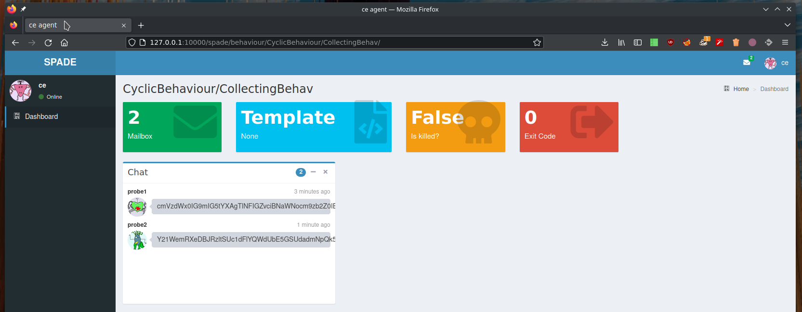

# The MAS Demonic Surveillance Platform

-----

**Table of Contents**

- [Presentation](#presentation)
- [Installation](#installation)
- [License](#license)

[Pumpkin](https://github.com/scandale-project/pumpkin),
the MAS Demonic Surveillance Platform, is a libre software which is providing
a __backend architecture__ for executing tests on an infrastructure, collecting
results and storing proof of checks.
It also provides different mechanisms of extensions and connections.





## Presentation

```mermaid
flowchart LR

A[Probe with periodic behaviour] -->|JSON formatted result| B(Aggregation)
AA[Probe with cyclic behaviour] -->|JSON formatted result| B
AAA[Probe with one shot behaviour] -->|JSON formatted result| B
B --> C(Correlation Engine with cyclic behaviour)
C -->|Write| D[Database]
C -->|Send| E[Ad hoc module]
F[External source] -->|HTTP POST| C
```

The purpose of this rather complex example is to show what it would currently
be possible to do. You can install a correlation engine with only one probe
on the same server. But probes can be deployed on a large scale and use a
behavioral mechanism to accomplish their duty.

A probe can reason locally or globally.
The selection of the communication channel between probes is automatic,
based on the probes duties, behaviour and availability. A probe do not
need to know the IP server of an other component of the architecture
(database, correlation engine, etc.).

Each probe agent is authenticated, registered and declare its availability
(for the presence notification system). The OMEMO protocol can be used for
communications between agents.

``Ad hoc module``: a module in order to share data with external platforms,
such as MISP or other database systems.

The correlation agent also provides a PubSub mechanism.

More information in the [documentation](https://pumpkin-project.readthedocs.io).

You can see some screen shots [here](docs/_static/).


## Installation

### Install an XMPP server

To choose an XMPP server, visit this [page](https://xmpp.org/software/servers.html).

To create a new XMPP account you can follow the steps
[here](https://xmpp.org/getting-started/).
Create an XMPP account for each demon.
Each demon will have a different JID and a different password.

### Install the correlation agent


```shell
$ poetry install
```


## Documentation

A documentation is available [here](https://pumpkin-project.readthedocs.io).

A list of references articles is provided [here](https://pumpkin-project.readthedocs.io/en/latest/references.html).


## License

`pumpkin` is distributed under the terms of the
[GNU Affero General Public License version 3](https://www.gnu.org/licenses/agpl-3.0.html).

Copyright (C) 2022-2023 [Cédric Bonhomme](https://www.cedricbonhomme.org)
